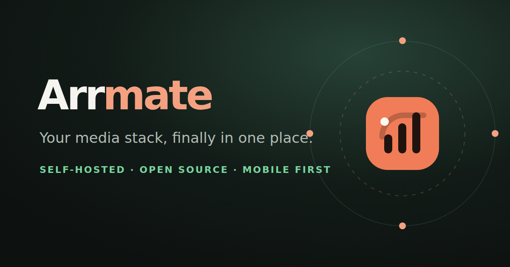

# Arrmate

**The friendly control plane for your self-hosted media stack.**

Arrmate is an open-source, mobile-first management experience for Jellyfin ecosystems. It brings discovery, requests, downloads, library health, subtitle workflows, and service operations into one fast interface instead of making people jump between a pile of separate dashboards.

> **Status:** full MVP ready for self-hosted install. Jellyfin/Jellyseerr
> sign-in, discovery, requests with season selection, basarr subtitle
> management, Sonarr/Radarr interactive release search and replace, full
> library browsing with file/quality visibility, qBittorrent queue and
> transfer stats, and Jellyfin admin user/reset/history workflows are all
> wired against real services. The first-run `/setup` wizard verifies each
> service live before persisting encrypted credentials.



## The idea

The name comes from the _arr_ family of services and a friendly companion that helps keep a homelab media setup moving. The product should feel like a polished native app on a phone, while remaining useful on tablets, desktop browsers, and eventually any device with a modern web browser.

Arrmate is inspired by the unified feel of nzb360, but the goal is a self-hosted, open-source product with a first-class request experience rather than a basic launcher for separate services.

## Product goals

- One responsive, smartphone-first interface for a Jellyfin media server and its supporting services.
- Live operational visibility: download queues, speeds, health, storage, jobs, and recent activity.
- Fast discovery and requests for movies and series.
- Admin workflows for manual torrent selection, queue actions, media deletion, replacement, searches, and subtitle management.
- A safe public/friend-facing experience with reduced permissions and configurable movie/series rate limits.
- Per-user permissions, quotas, audit history, and easy limit changes from a phone.
- A visual system that feels calm, quick, modern, and proud to be open source.
- No fake success states: when a service is disconnected or an action is unavailable, the UI should say so clearly.

## Integration map

Arrmate keeps its domain model separate from any one vendor. The current target
map is based on the real public service inventory used to shape this project:

- Jellyfin
- Jellyseerr
- Sonarr
- Radarr
- Prowlarr
- Bazarr
- Lidarr
- qBittorrent
- Cleanuparr
- Unmanic
- FlareSolverr
- JFA

Huntarr was part of the original idea but was not present in that inventory, so
it remains an optional future adapter rather than a claimed active dependency.
Other download clients, request managers, indexers, media servers, notification
providers, and health tools can implement the same capability contracts.

## Sign in once with Jellyfin

People do not create a second Arrmate account. The sign-in form sends their
Jellyfin username and password to an Arrmate server action, which immediately
exchanges them through Jellyseerr. The password is never stored or returned to
browser code.

Arrmate encrypts the resulting user-scoped Jellyseerr session in an HTTP-only
cookie. Search, quotas, and requests then run as that person, preserving
Jellyseerr attribution, movie/series permissions, approval rules, and limits.
No Jellyseerr API key is needed for this flow.

## Permission model direction

Arrmate should support at least these conceptual roles:

- **Owner/admin:** service configuration, integrations, users, quotas, manual torrent controls, destructive media actions, audit logs, and system settings.
- **Maintainer:** operational controls and library workflows, but no ownership/security changes unless explicitly granted.
- **Requester:** discovery, requests, request status, and permitted subtitle or notification preferences.
- **Guest:** narrowly scoped public discovery/request experience governed by configured limits.

Every mutation should be authorized server-side. Hiding a button is not authorization.

## Technical foundation

The current implementation uses:

- Next.js 16 with strict TypeScript for the web application and server boundary.
- A custom responsive CSS and original SVG brand system with no external font request.
- PostgreSQL for Arrmate-owned users, sessions, permissions, quotas, integrations, request records, audit events, and cached normalized state.
- AES-256-GCM authenticated encryption for the user-scoped Jellyseerr session cookie.
- A server-only, response-validated Jellyseerr adapter for sign-in, health, live search, quotas, requests, and logout.
- Typed adapter interfaces and capability checks so unsupported service features degrade gracefully.
- A server-only, response-validated qBittorrent adapter for live queue and transfer data.
- A server-only, response-validated Sonarr/Radarr adapter for series, movies, episodes, files, release search, blocking, and interactive grab/replace.
- A server-only, response-validated Bazarr adapter for series/movie subtitles, search, downloads, and deletion.
- AES-256-GCM encrypted, file-based credential storage so the `/setup` wizard can persist service URLs/keys without a redeploy.
- Docker-first local development and tests at the domain, adapter, authorization, and browser workflow boundaries.

## Repository layout

```text
src/
  app/                 # routes and screens
  components/          # reusable UI
  server/              # application services and adapter orchestration
  adapters/            # external service integrations
  db/                  # schema, migrations, repositories
docs/
  product/             # product and UX decisions
  architecture/        # system and adapter decisions
  plans/               # implementation plans
tests/
NEXT_PROMPT.md
```

The current slice exposes Sonarr/Radarr media browsing and interactive
release search with grab + blocklist. Bazarr subtitle download/delete and
media file deletion are guarded behind the operator role and audited.
qBittorrent serves a live queue plus aggregated transfer stats (day, week,
month, year), persisting snapshots to either PostgreSQL or in-memory when
the database is unavailable. Discovery stays disconnected until
`SEERR_URL` points to an authorized Jellyseerr instance.

Original editable identity assets live in [`public/assets/`](./public/assets/):
the app mark, lockup, orbit illustration, installable icons, and social card.

## Safety and privacy

Arrmate is intended for self-hosted deployments. Integrations will handle powerful APIs and potentially destructive actions. The project must therefore:

- keep credentials server-side and encrypted at rest where practical;
- never expose upstream API keys to browsers or requesters;
- require explicit confirmation for destructive operations;
- log who performed destructive and administrative actions;
- make rate limits and public access boundaries explicit;
- avoid assuming that an internet-facing deployment is safe merely because the UI has a login page;
- provide a threat model and deployment security documentation before calling a release production-ready.

## Local development

```bash
npm install
cp .env.example .env.local
npm run dev
```

Then open `http://localhost:3000/setup` and follow the wizard. The first
step signs in with Jellyseerr + Jellyfin. If the signed-in account is an
administrator, the second step shows live-verified inputs for Radarr,
Sonarr, Bazarr, and qBittorrent. Each optional service is tested against
the real upstream before being saved to the encrypted local credential
store.

Node.js 22 or newer and npm 10 are supported. No database is required:
without PostgreSQL, audit and transfer history stay in the running
Arrmate process. Environment variables still work as a fallback if you
prefer to keep credentials in `.env.local`.

Generate real development secrets before testing sign-in:

```bash
openssl rand -base64 48 # use for AUTH_SECRET
openssl rand -base64 32 # use for NEXT_SERVER_ACTIONS_ENCRYPTION_KEY
```

Set `SEERR_URL` to an authorized Jellyseerr base URL to enable Jellyfin sign-in,
discovery, quotas, and requests. Set the qBittorrent variables to enable the
read-only live operations path. All integration variables are server-only;
never prefix them with `NEXT_PUBLIC_`.

Before contributing, run:

```bash
npm run format:check
npm run lint
npm run typecheck
npm test
npm run test:browser
npm run build
```

Architecture, threat-model, product, and milestone decisions live under [`docs/`](./docs/).

## Contributing

Arrmate should be welcoming to homelab users who are not enterprise developers. Contributions need clear setup instructions, reproducible tests, security-minded review, and an explanation of how a change behaves when an external service is unavailable.

See [`CONTRIBUTING.md`](./CONTRIBUTING.md), [`SECURITY.md`](./SECURITY.md), and [`CODE_OF_CONDUCT.md`](./CODE_OF_CONDUCT.md).

## License

MIT. See [`LICENSE`](./LICENSE).

## Name note

The working project name is **Arrmate**, selected by Zeb on 2026-08-16. It can still evolve before the first public release, but the local project and repository foundation use this name consistently.
